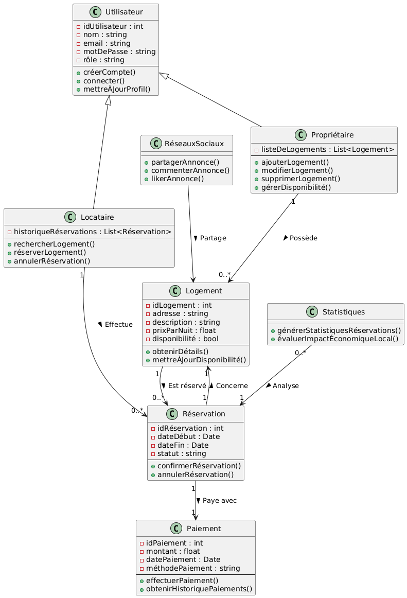

# N'bnb same app Air'bnb

## Diagramm use case

**Acteurs :**  

_Propriétaire_ : Utilisateur qui possède et gère des logements à louer.  
_Locataire_ : Utilisateur qui réserve des logements pour des séjours de courte durée.  
_Administrateur_ : Gère les utilisateurs, surveille les opérations et maintient l'application.  
_Système de Paiement_ : Interface avec PayPal, Stripe et les cartes bancaires pour les transactions.  
_Réseaux Sociaux_ : Intégration des fonctionnalités de réseaux sociaux communautaires.  


**Cas d'Utilisation :**  

- Gérer les Utilisateurs :  
    - Création d'un compte (Propriétaire, Locataire)  
    - Connexion/Déconnexion  
    - Mise à jour du profil  

- Gérer les Logements (Propriétaire) :  
    - Ajouter un logement  
    - Modifier les informations d'un logement  
    - Supprimer un logement  
    - Gérer la disponibilité  

- Rechercher et Réserver un Logement (Locataire) :  
    - Rechercher un logement (avec filtres)  
    - Visualiser les détails d'un logement  
    - Réserver un logement  
    - Annuler une réservation  

- Gérer les Réservations (Propriétaire) :  
    - Confirmer une réservation  
    - Annuler une réservation  
    - Visualiser l'historique des réservations  

- Paiement :  
    - Effectuer un paiement (via PayPal, Stripe, CB)  
    - Visualiser l'historique des paiements  

- Générer des Statistiques (Administrateur) :  
    - Statistiques sur les réservations  
    - Évaluation de l'impact économique local  

- Intégration des Réseaux Sociaux :  
    - Partager un logement sur les réseaux sociaux  
    - Commenter et liker les annonces de logements  

- Gérer les Rôles et Permissions (Administrateur) :  
    - Gestion des rôles (Propriétaire, Locataire, Administrateur)  
    - Assurer la sécurité et la conformité  


## UML class 



```
@startuml

' Définition des classes

class Utilisateur {
    - idUtilisateur : int
    - nom : string
    - email : string
    - motDePasse : string
    - rôle : string
    --
    + créerCompte() 
    + connecter() 
    + mettreÀJourProfil() 
}

class Propriétaire {
    - listeDeLogements : List<Logement>
    --
    + ajouterLogement()
    + modifierLogement()
    + supprimerLogement()
    + gérerDisponibilité()
}

class Locataire {
    - historiqueRéservations : List<Réservation>
    --
    + rechercherLogement()
    + réserverLogement()
    + annulerRéservation()
}

class Logement {
    - idLogement : int
    - adresse : string
    - description : string
    - prixParNuit : float
    - disponibilité : bool
    --
    + obtenirDétails() 
    + mettreÀJourDisponibilité()
}

class Réservation {
    - idRéservation : int
    - dateDébut : Date
    - dateFin : Date
    - statut : string
    --
    + confirmerRéservation()
    + annulerRéservation()
}

class Paiement {
    - idPaiement : int
    - montant : float
    - datePaiement : Date
    - méthodePaiement : string
    --
    + effectuerPaiement()
    + obtenirHistoriquePaiements()
}

class Statistiques {
    + générerStatistiquesRéservations()
    + évaluerImpactÉconomiqueLocal()
}

class RéseauxSociaux {
    + partagerAnnonce()
    + commenterAnnonce()
    + likerAnnonce()
}

' Relations d'héritage

Utilisateur <|-- Propriétaire
Utilisateur <|-- Locataire

' Relations de composition et d'association

Propriétaire "1" --> "0..*" Logement : Possède >
Logement "1" --> "0..*" Réservation : Est réservé >
Locataire "1" --> "0..*" Réservation : Effectue >
Réservation "1" --> "1" Paiement : Paye avec >
Réservation "1" --> "1" Logement : Concerne >
Statistiques "0..*" --> "1" Réservation : Analyse >
RéseauxSociaux --> Logement : Partage >

@enduml


```